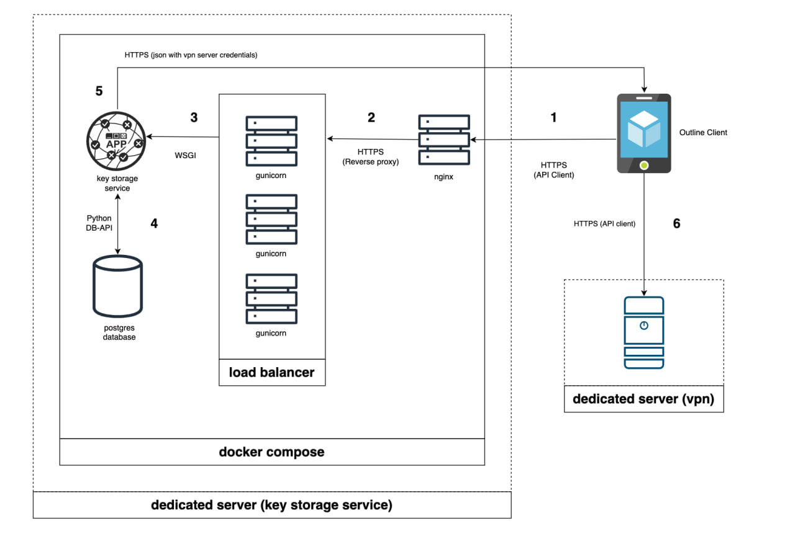

### Installation

1. Clone project using command `git clone git@github.com:insideItself/404state_key_storage.git`
2. Create `.env`-file in main project directory that will contains project credentials. Use file `.env.EXAMPLE` as example.
3. Run project using command `docker-compose up -d --build --scale app=1`. Use app=number to specify number of web-servers that you want to use.
---
### Project Schema

1. User press 'Connect' button in Outline app. Outline app sends HTTPS request to NGINX-server.
2. After receiving request from Outline client, NGINX sends HTTPS request to one of gunicorn web-servers.
3. Gunicorn using WSGI sends HTTPS request to flask-app. Request contains user UUID.
4. Flask-app using user UUID sends request to Postgres database to find the following data:
   * vpn-server hostname
   * vpn-server port
   * user password
   * encryption method
5. After the data has been successfully retrieved from the database, flask-app creates json-file and sends it back to Outline app through HTTPS.
6. Outline client connect user to vpn-server using credentials from json-file.



---
## API Usage

#### Authentication

This service uses only basic authentication.
Basic authentication required for all endpoints except GET-requests.

#### Methods

 (GET) GET key data
```bash
curl -x GET <hostname>/key/<name>/<UUID>
```

(POST) Create key
```bash
curl -X POST \
     -u "username:password" \
     -H "Content-Type: application/json" \
     -d '{
         "uuid": "0000bbbb-0000bbbb-00aa-00aa-0000bbbb",
         "name": "sophia",
         "server": "0.0.0.0",
         "server_port": 1111,
         "password": "p4ssw0rd",
         "method": "encryption-method_401",
         "is_active": true
         }' \
     <hostname>/key
```

(PUT) Modify key
```bash
curl -X POST \
     -u "username:password" \
     -H "Content-Type: application/json" \
     -d '{
         "uuid": "0000bbbb-0000bbbb-00aa-00aa-0000bbbb",
         "name": "sophia",
         "server": "0.0.0.0",
         "server_port": 1111,
         "password": "p4ssw0rd",
         "method": "encryption-method_401",
         "is_active": false
         }' \
     <hostname>/key
```

#### Json-example for PUT/POST-requests

```json
{
   "uuid": "0000bbbb-0000bbbb-00aa-00aa-0000bbbb",
   "name": "sophia",
   "server": "0.0.0.0",
   "server_port": 1111,
   "password": "p4ssw0rd",
   "method": "encryption-method_401",
   "is_active": true
}
```

#### Response codes

| Request method | Response Code | Notes                                                                              |
|:--------------:|:-------------:|------------------------------------------------------------------------------------|
|      GET       |      400      | Name or UUID was not provided via GET-request                                      |
|      GET       |      404      | Requested data was not found                                                       |
|      GET       |      500      | Any other error types, additional information will be provided in request response |
|      POST      |      400      | Some of the required fields for POST-request were filled in incorrectly            |
|      POST      |      201      | SUCCESS                                                                            |
|      POST      |      500      | Any other error types, additional information will be provided in request response |
|      PUT       |      400      | Some of the required fields for PUT-request were filled in incorrectly             |
|      PUT       |      201      | SUCCESS                                                                            |
|      PUT       |      500      | Any other error types, additional information will be provided in request response |
|  POST/PUT/GET  |      401      | Authentification failed                                                            |