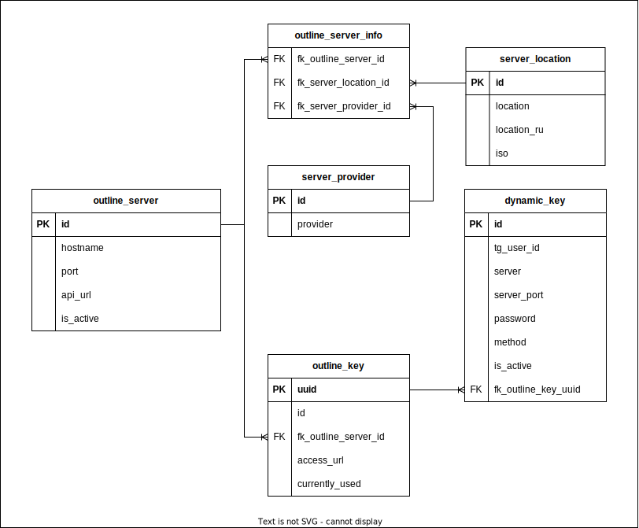
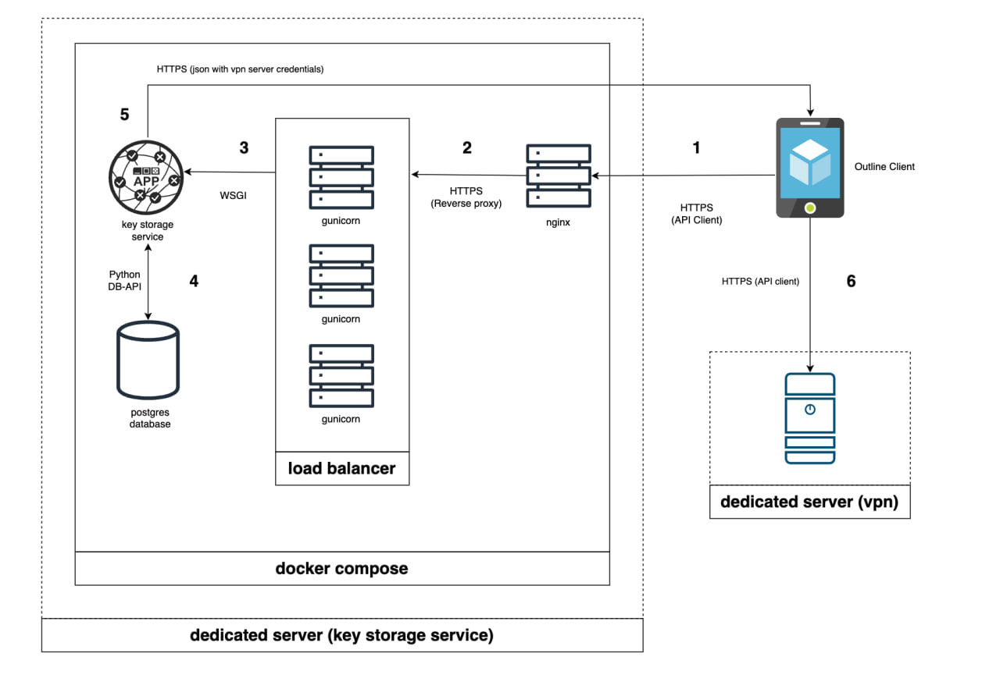

### Installation

#### Local Machine

1. Clone project using command `git clone git@github.com:insideItself/404state_key_storage.git`
2. Create `.env`-file in main project directory that will contains project credentials. Use file `.env.EXAMPLE` as example.
3. Create directory for your database, for example `./database_for_project`.
4. Install `mkcert` and setup SSL certificates for localhost: https://github.com/FiloSottile/mkcert. Specify path to your certificates in `.env` file.
5. Run project using command `docker compose -f docker-compose.local.yml up -d --build --scale app=1`. Use app=number to specify number of web-servers that you want to use.
6. Stop project using command `docker compose -f docker-compose.local.yml down` if necessary.
7. If you want to run just database and test app running it manually, first you need to run database instance via docker `docker compose -f docker-compose.local.yml up --build -d database`
8. Run tests using `python3 -m pytest -vv` command.

#### VDS

1. Install docker, docker-compose, python, pip3, git, openssh-server on VDS.
2. Set up ssh keys, turn off connection by password, reboot server.
3. Clone project using command `git clone git@github.com:insideItself/404state_key_storage.git`
4. Create `.env`-file in main project directory that will contains project credentials. Use file `.env.EXAMPLE` as example.
5. Create directory for your database on VDS, for example `/opt/database_for_project`, specify path to database in `.env` file, give permission to postgres user to operate this directory with: `sudo chown -R 999:999 /opt/database_for_project`
6. Set up a domain for your server IP-address.
7. Run project using command `docker compose -f docker-compose.yml up -d --build --scale app=1`. Use app=number to specify number of web-servers that you want to use.
8. Stop project using command `docker compose -f docker-compose.yml down` if necessary.

---
### Database Schema

#### Table: `outline_server`

| Column Name  | Data Type | Constraints  | Description                                              |
|--------------|-----------|--------------|----------------------------------------------------------|
| id           | INTEGER   | PRIMARY KEY  | Unique identifier                                        |
| hostname     | VARCHAR   | NOT NULL     | Outline server Hostname or IP address                    |
| port         | INTEGER   | NOT NULL     | Outline server port for access keys                      |
| api_url      | VARCHAR   | NOT NULL     | Unique identifier of API URL to manage an Outline server |

#### Table: `outline_server_info`

| Column Name           | Data Type | Constraints           | Description                                                           |
|-----------------------|-----------|-----------------------|-----------------------------------------------------------------------|
| fk_outline_server_id  | INTEGER   | FOREIGN KEY, NOT NULL | Foreign Key `fk_outline_server_id` references `outline_server(id)`.   |
| fk_server_location_id | VARCHAR   | FOREIGN KEY, NOT NULL | Foreign Key `fk_server_location_id` references `server_location(id)`. |
| fk_server_provider_id | VARCHAR   | FOREIGN KEY, NOT NULL | Foreign Key `fk_server_provider_id` references `server_provider(id)`. |

#### Table: `server_location`

| Column Name | Data Type | Constraints                                               | Description                                                              |
|-------------|-----------|-----------------------------------------------------------|--------------------------------------------------------------------------|
| id          | INTEGER   | PRIMARY KEY                                               | Unique identifier.                                                       |
| location    | VARCHAR   | NOT NULL, UNIQUE                                          | Location name (English).                                                 |
| location_ru | VARCHAR   | NOT NULL, UNIQUE                                          | Location name (Russian).                                                 |
| iso         | CHAR(2)   | NOT NULL, CAPITAL LETTERS ONLY, CHECK(LENGTH = 2), UNIQUE | Location ISO code (For example, United Kingdom = GB, Hong Kong  HK, etc) |

#### Table: `server_provider`

| Column Name | Data Type | Constraints                                       | Description                                                              |
|-------------|-----------|---------------------------------------------------|--------------------------------------------------------------------------|
| id          | INTEGER   | PRIMARY KEY                                       | Unique identifier.                                                       |
| provider    | VARCHAR   | NOT NULL                                          | Provider name.                                                           |

#### Table: `outline_key`

| Column Name          | Data Type | Constraints           | Description                                                                                  |
|----------------------|-----------|-----------------------|----------------------------------------------------------------------------------------------|
| uuid                 | UUID      | PRIMARY KEY           | Unique identifier.                                                                           |
| id                   | INTEGER   | NOT NULL              | Standard Outline VPN Key identifier on a Outline server.                                     |
| fk_outline_server_id | INTEGER   | FOREIGN KEY, NOT NULL | Foreign Key `fk_outline_server_id` references `outline_server(id)`.                          |
| access_url           | VARCHAR   | NOT NULL              | Standard Outline VPN key that provides access to VPN on a Outline Server.                    |
| currently_used       | BOOLEAN   | NOT NULL              | Equals `true` if it is currently connected to some of dynamic keys otherwise equals `false`. |

#### Table: `dynamic_key`

| Column Name         | Data Type | Constraints                                              | Description                                                                                                                                   |
|---------------------|-----------|----------------------------------------------------------|-----------------------------------------------------------------------------------------------------------------------------------------------|
| id                  | INTEGER   | PRIMARY KEY, CHECK (id >= 100000000 AND id <= 999999999) | Unique identifier. Always 9 symbols length.                                                                                                   |
| tg_user_id          | BIGINT    | NOT NULL                                                 | Unique identifier of telegram bot user. References `tg_user(id)` in shadowtrail telegram bot database.                                        |
| server              | VARCHAR   | NOT NULL                                                 | Outline server Hostname or IP address.                                                                                                        |
| server_port         | INTEGER   | NOT NULL                                                 | Outline server port for access keys.                                                                                                          |
| password            | VARCHAR   | NOT NULL                                                 | Outline VPN key password.                                                                                                                     |
| method              | VARCHAR   | NOT NULL                                                 | Outline VPM key encryption method.                                                                                                            |
| is_active           | BOOLEAN   | NOT NULL                                                 | Equals `true` if it is currently connected to telegram bot user with active VPN subscription otherwise equals `false`.                        |
| fk_outline_key_uuid | UUID      | FOREIGN KEY, NOT NULL                                    | Foreign Key `fk_outline_key_uuid` references `outline_key(uuid)`.   Dynamic keys always referencing one of the standard Outline VPN Keys. |

---
### Project Schema

1. User press 'Connect' button in Outline app. Outline app sends HTTPS request to NGINX-server.
2. After receiving request from Outline client, NGINX sends HTTPS request to one of gunicorn web-servers.
3. Gunicorn using WSGI sends HTTPS request to flask-app. Request contains user UUID.
4. Flask-app using user UUID sends request to Postgres database to find the following data:
   * vpn-server hostname
   * vpn-server port
   * user password
   * encryption method
5. After the data has been successfully retrieved from the database, flask-app creates json-file and sends it back to Outline app through HTTPS.
6. Outline client connect user to vpn-server using credentials from json-file.

---
## API

Shadowtrail Key Storage REST API follows the OpenAPI specification that can be found at statis/api.yml.

In addition to the above, you can find an interactive version of this documentation on your local instance at `your_hostname/api/docs` after running project.